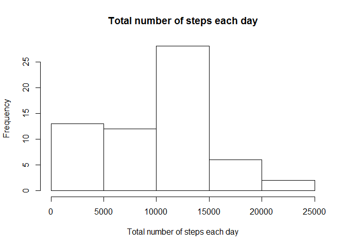
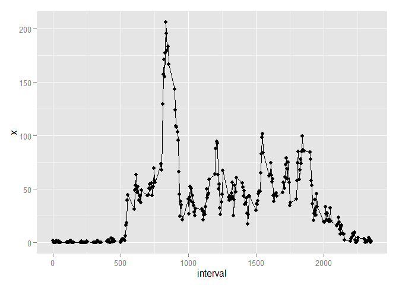
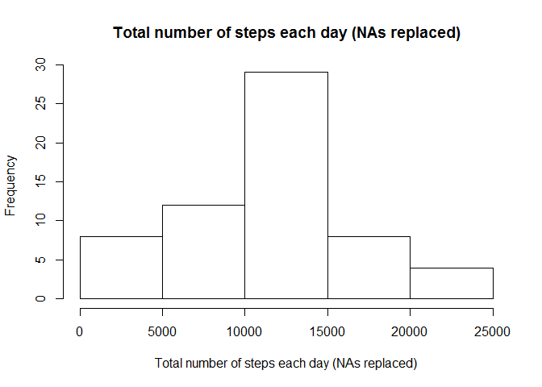
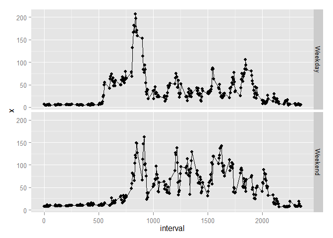

# Reproducible Research: Peer Assessment 1


## Loading and preprocessing the data


```r
require(ggplot2)
```

```
## Loading required package: ggplot2
```

```r
# Read dataset
activity <- read.csv("activity.csv")
```

## What is mean total number of steps taken per day?

1. Make a histogram of the total number of steps taken each day


```r
# Aggregate steps per day and plot in histogram
aggtot <- aggregate(activity$steps, by=list(date=activity$date), FUN=sum, na.rm=TRUE)
hist(aggtot$x, main="Total number of steps each day", xlab="Total number of steps each day")
```

 

2. Calculate and report the mean and median total number of steps taken per day


```r
# Aggregate mean steps per day 
agg <- aggregate(activity$steps, by=list(date=activity$date), FUN=mean, na.rm=TRUE)
names(agg) <- c('date', 'mean')

# Aggregate median steps per day
aggmed <- aggregate(activity$steps, by=list(date=activity$date), FUN=median, na.rm=TRUE)
agg$median = aggmed$x

# Report mean and median steps per day in a table
agg
```

```
##          date       mean median
## 1  2012-10-01        NaN     NA
## 2  2012-10-02  0.4375000      0
## 3  2012-10-03 39.4166667      0
## 4  2012-10-04 42.0694444      0
## 5  2012-10-05 46.1597222      0
## 6  2012-10-06 53.5416667      0
## 7  2012-10-07 38.2465278      0
## 8  2012-10-08        NaN     NA
## 9  2012-10-09 44.4826389      0
## 10 2012-10-10 34.3750000      0
## 11 2012-10-11 35.7777778      0
## 12 2012-10-12 60.3541667      0
## 13 2012-10-13 43.1458333      0
## 14 2012-10-14 52.4236111      0
## 15 2012-10-15 35.2048611      0
## 16 2012-10-16 52.3750000      0
## 17 2012-10-17 46.7083333      0
## 18 2012-10-18 34.9166667      0
## 19 2012-10-19 41.0729167      0
## 20 2012-10-20 36.0937500      0
## 21 2012-10-21 30.6284722      0
## 22 2012-10-22 46.7361111      0
## 23 2012-10-23 30.9652778      0
## 24 2012-10-24 29.0104167      0
## 25 2012-10-25  8.6527778      0
## 26 2012-10-26 23.5347222      0
## 27 2012-10-27 35.1354167      0
## 28 2012-10-28 39.7847222      0
## 29 2012-10-29 17.4236111      0
## 30 2012-10-30 34.0937500      0
## 31 2012-10-31 53.5208333      0
## 32 2012-11-01        NaN     NA
## 33 2012-11-02 36.8055556      0
## 34 2012-11-03 36.7048611      0
## 35 2012-11-04        NaN     NA
## 36 2012-11-05 36.2465278      0
## 37 2012-11-06 28.9375000      0
## 38 2012-11-07 44.7326389      0
## 39 2012-11-08 11.1770833      0
## 40 2012-11-09        NaN     NA
## 41 2012-11-10        NaN     NA
## 42 2012-11-11 43.7777778      0
## 43 2012-11-12 37.3784722      0
## 44 2012-11-13 25.4722222      0
## 45 2012-11-14        NaN     NA
## 46 2012-11-15  0.1423611      0
## 47 2012-11-16 18.8923611      0
## 48 2012-11-17 49.7881944      0
## 49 2012-11-18 52.4652778      0
## 50 2012-11-19 30.6979167      0
## 51 2012-11-20 15.5277778      0
## 52 2012-11-21 44.3993056      0
## 53 2012-11-22 70.9270833      0
## 54 2012-11-23 73.5902778      0
## 55 2012-11-24 50.2708333      0
## 56 2012-11-25 41.0902778      0
## 57 2012-11-26 38.7569444      0
## 58 2012-11-27 47.3819444      0
## 59 2012-11-28 35.3576389      0
## 60 2012-11-29 24.4687500      0
## 61 2012-11-30        NaN     NA
```

## What is the average daily activity pattern?

1. Make a time series plot (i.e. type = "l") of the 5-minute interval (x-axis) and the average number of steps taken, averaged across all days (y-axis)


```r
# Create time series plot of 5 minute interval and average number of steps taken
aggivl = aggregate(activity$steps, by=list(interval=activity$interval), FUN=mean, na.rm=TRUE)
qplot(interval, x, data=aggivl) + geom_line()
```

 


2. Which 5 minute interval contains the maximum number of steps?


```r
aggivl[order(aggivl$x, decreasing=TRUE),][1,1]
```

```
## [1] 835
```

## Imputing missing values

1. Calculate and report the total number of missing values in the dataset (i.e. the total number of rows with NAs)


```r
sum(is.na(activity))
```

```
## [1] 2304
```

2. Devise a strategy for filling in all of the missing values in the dataset. The strategy does not need to be sophisticated. For example, you could use the mean/median for that day, or the mean for that 5-minute interval, etc.


```r
# Check for missing values in the source data. 
# Create new dataset in which all NAs are replaced by the mean of their interval

aggmeanivl <- aggregate(activity$steps, by=list(interval=activity$interval), FUN=mean, na.rm=TRUE)
merge <- merge(activity, aggmeanivl, by.x="interval", by.y="interval")
```

3. Create a new dataset that is equal to the original dataset but with the missing data filled in.


```r
activityNoNA <- activity
missing <- is.na(activityNoNA$steps)
activityNoNA[missing,]$steps <- merge[missing,]$x
```

4. Make a histogram of the total number of steps taken each day and Calculate and report the mean and median total number of steps taken per day. Do these values differ from the estimates from the first part of the assignment? What is the impact of imputing missing data on the estimates of the total daily number of steps?


```r
# Aggregate steps per day (without NAs) and plot in histogram
aggtotNoNA <- aggregate(activityNoNA$steps, by=list(date=activity$date), FUN=sum, na.rm=TRUE)
hist(aggtotNoNA$x, main="Total number of steps each day (NAs replaced)", xlab="Total number of steps each day (NAs replaced)")
```

 

```r
# Aggregate mean steps per day (without NAs)
aggNoNA <- aggregate(activityNoNA$steps, by=list(date=activityNoNA$date), FUN=mean, na.rm=TRUE)
names(aggNoNA) <- c('date', 'mean')

# Aggregate median steps per day (without NAs)
aggmedNoNA <- aggregate(activityNoNA$steps, by=list(date=activityNoNA$date), FUN=median, na.rm=TRUE)
aggNoNA$median = aggmedNoNA$x

# Report mean and median steps per day (without NAs) in a table
aggNoNA
```

```
##          date       mean     median
## 1  2012-10-01  0.5070755  0.1509434
## 2  2012-10-02  0.4375000  0.0000000
## 3  2012-10-03 39.4166667  0.0000000
## 4  2012-10-04 42.0694444  0.0000000
## 5  2012-10-05 46.1597222  0.0000000
## 6  2012-10-06 53.5416667  0.0000000
## 7  2012-10-07 38.2465278  0.0000000
## 8  2012-10-08  0.5275157  0.0000000
## 9  2012-10-09 44.4826389  0.0000000
## 10 2012-10-10 34.3750000  0.0000000
## 11 2012-10-11 35.7777778  0.0000000
## 12 2012-10-12 60.3541667  0.0000000
## 13 2012-10-13 43.1458333  0.0000000
## 14 2012-10-14 52.4236111  0.0000000
## 15 2012-10-15 35.2048611  0.0000000
## 16 2012-10-16 52.3750000  0.0000000
## 17 2012-10-17 46.7083333  0.0000000
## 18 2012-10-18 34.9166667  0.0000000
## 19 2012-10-19 41.0729167  0.0000000
## 20 2012-10-20 36.0937500  0.0000000
## 21 2012-10-21 30.6284722  0.0000000
## 22 2012-10-22 46.7361111  0.0000000
## 23 2012-10-23 30.9652778  0.0000000
## 24 2012-10-24 29.0104167  0.0000000
## 25 2012-10-25  8.6527778  0.0000000
## 26 2012-10-26 23.5347222  0.0000000
## 27 2012-10-27 35.1354167  0.0000000
## 28 2012-10-28 39.7847222  0.0000000
## 29 2012-10-29 17.4236111  0.0000000
## 30 2012-10-30 34.0937500  0.0000000
## 31 2012-10-31 53.5208333  0.0000000
## 32 2012-11-01 68.6481918 63.3962264
## 33 2012-11-02 36.8055556  0.0000000
## 34 2012-11-03 36.7048611  0.0000000
## 35 2012-11-04 42.2416143 42.7547170
## 36 2012-11-05 36.2465278  0.0000000
## 37 2012-11-06 28.9375000  0.0000000
## 38 2012-11-07 44.7326389  0.0000000
## 39 2012-11-08 11.1770833  0.0000000
## 40 2012-11-09 57.5720650 48.1320755
## 41 2012-11-10 83.8531840 83.9622642
## 42 2012-11-11 43.7777778  0.0000000
## 43 2012-11-12 37.3784722  0.0000000
## 44 2012-11-13 25.4722222  0.0000000
## 45 2012-11-14 70.0638103 72.7169811
## 46 2012-11-15  0.1423611  0.0000000
## 47 2012-11-16 18.8923611  0.0000000
## 48 2012-11-17 49.7881944  0.0000000
## 49 2012-11-18 52.4652778  0.0000000
## 50 2012-11-19 30.6979167  0.0000000
## 51 2012-11-20 15.5277778  0.0000000
## 52 2012-11-21 44.3993056  0.0000000
## 53 2012-11-22 70.9270833  0.0000000
## 54 2012-11-23 73.5902778  0.0000000
## 55 2012-11-24 50.2708333  0.0000000
## 56 2012-11-25 41.0902778  0.0000000
## 57 2012-11-26 38.7569444  0.0000000
## 58 2012-11-27 47.3819444  0.0000000
## 59 2012-11-28 35.3576389  0.0000000
## 60 2012-11-29 24.4687500  0.0000000
## 61 2012-11-30  1.8287474  1.0754717
```

These values are different from the values displayed earlier. The zero-count in the histogram is signficantly lower.

## Are there differences in activity patterns between weekdays and weekends?

1. Create a new factor variable in the dataset with two levels – “weekday” and “weekend” indicating whether a given date is a weekday or weekend day.


```r
activityNoNA$date <- as.Date(activityNoNA$date)

# Generate day of weeks from date and determine if it is weekend or weekday

# Set locale to English to format weekdays correctly (works on Windows only)
# Uncomment the following statement if weekdays are generated in your local language
Sys.setlocale("LC_TIME", "English")
```

```
## [1] "English_United States.1252"
```

```r
activityNoNA$weekday <- weekdays(activityNoNA$date)
activityNoNA$weekend <- activityNoNA$weekday
activityNoNA[activityNoNA$weekday %in% c('Saturday', 'Sunday'),]$weekend <- 'Weekend'
activityNoNA[!activityNoNA$weekday %in% c('Saturday', 'Sunday'),]$weekend <- 'Weekday'

# Aggregate data by interval and weekday type (weekend or weekday)
aggNoNAivl<- aggregate(activityNoNA$steps, by=list(interval=activityNoNA$interval, weekend=activityNoNA$weekend), FUN=mean, na.rm=TRUE)
```

2. Make a panel plot containing a time series plot (i.e. type = "l") of the 5-minute interval (x-axis) and the average number of steps taken, averaged across all weekday days or weekend days (y-axis). See the README file in the GitHub repository to see an example of what this plot should look like using simulated data.


```r
# Generate plot
p <- qplot(interval, x, data=aggNoNAivl) + geom_line()
p + facet_grid(weekend ~ .)
```

 

